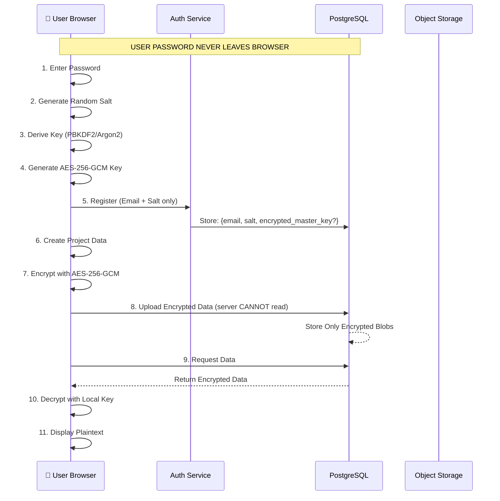
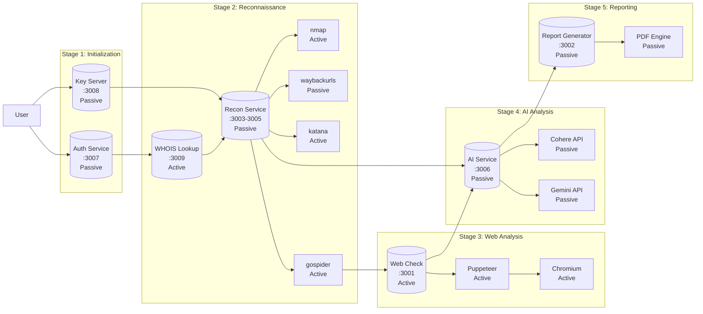
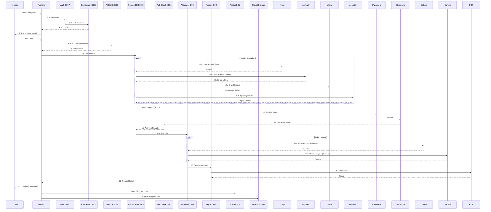

# RedKit Production Architecture - Zero-Knowledge Privacy

```mermaid
flowchart TB
    subgraph "🔴 RedKit - Penetration Testing Framework"
        
        subgraph "🌐 External Network"
            User[("👤 Security Analyst<br/>Browser")]
            Internet["🌍 Internet"]
        end

        subgraph "☁️ Cloud Infrastructure"
            subgraph "🐳 Container Orchestration"
                DockerSwarm["Docker Swarm<br/>& Traefik"]
            end
            
            subgraph "🔄 Reverse Proxy Layer"
                Traefik["Traefik<br/>Load Balancer<br/>SSL Termination<br/>:80, :443"]
            end
        end

        subgraph "🖥️ Application Services"
            
            subgraph "🎨 Presentation Layer"
                Frontend["Frontend<br/>React + Vite + Nginx<br/>:5173"]
            end

            subgraph "🔍 Core Services"
                
                subgraph "Reconnaissance Engine"
                    Recon["Recon Service<br/>Subdomain Enum<br/>Port Scan<br/>Endpoint Discovery<br/>:3003, :3004, :3005"]
                    nmap["nmap<br/>Network Scanner"]
                    wayback["waybackurls<br/>URL Archive"]
                    katana["katana<br/>Web Crawler"]
                    gospider["gospider<br/>Spider"]
                end

                subgraph "Web Analysis"
                    WebCheck["Web Check<br/>Puppeteer + Chromium<br/>:3001"]
                end

                subgraph "AI-Powered Analysis"
                    AI["AI Service<br/>FastAPI + LLMs<br/>:3006"]
                    Cohere["Cohere API"]
                    Gemini["Google Gemini API"]
                end

                subgraph "Threat Intelligence"
                    WHOIS["WHOIS Lookup<br/>Node.js<br/>:3009"]
                end

                subgraph "Reporting Engine"
                    Report["Report Generator<br/>FastAPI + PDF<br/>:3002"]
                end
            end

            subgraph "🛡️ Security Tools"
                Kali["Kali Linux<br/>Penetration Testing<br/>VNC:6080<br/>WS:5050"]
                Proxy["MITM Proxy<br/>:8080"]
            end
        end

        subgraph "💾 Data & Cache Layer"
            Redis["Redis<br/>Session Cache<br/>:6379"]
            PostgresDB["PostgreSQL<br/>Encrypted Data<br/>:5432"]
            ObjectStore["S3/MinIO<br/>Encrypted Files<br/>:9000"]
        end

        subgraph "🔐 Zero-Knowledge Encryption Layer"
            
            subgraph "🛡️ Client-Side Encryption"
                CryptoJS["Web Crypto API<br/>AES-256-GCM"]
                KeyDerive["PBKDF2/Argon2<br/>Key Derivation"]
                EncryptedStorage["Encrypted<br/>Local Storage"]
            end

            subgraph "🔑 Key Management (Client)"
                MasterKey["Master Key<br/>Derived from Password"]
                Salt["Salt (random)<br/>Stored on Server"]
                PublicKey["Public Key<br/>For Key Exchange"]
                PrivateKey["Private Key<br/>NEVER leaves browser"]
            end

            subgraph "🆔 Identity & Auth"
                AuthService["Auth Service<br/>JWT + OAuth2<br/>:3007"]
                KeyServer["Key Server<br/>Public Keys<br/>:3008"]
            end
        end

        subgraph "📊 Observability & DevOps"
            
            subgraph "Monitoring"
                Prometheus["Prometheus<br/>Metrics Collection<br/>:9090"]
                Grafana["Grafana<br/>Dashboards<br/>:3000"]
                NodeExporter["Node Exporter<br/>System Metrics"]
                CAdvisor["cAdvisor<br/>Container Metrics"]
            end

            subgraph "Logging"
                ELK["ELK Stack<br/>Elasticsearch<br/>Logstash<br/>Kibana"]
                Fluentd["Fluentd<br/>Log Aggregator"]
            end

            subgraph "Secrets Management"
                Vault["HashiCorp Vault<br/>Secrets Management<br/>:8200"]
            end

            subgraph "CI/CD Pipeline"
                GitHubActions["GitHub Actions<br/>Automated Testing"]
                Harbor["Harbor<br/>Container Registry"]
            end
        end

        subgraph "🚫 Security Services"
            WAF["WAF<br/>Web Application Firewall"]
            Fail2Ban["Fail2Ban<br/>Intrusion Prevention"]
        end
    end

    %% User Connections
    User -->|HTTPS| WAF
    WAF -->|HTTP| Traefik
    Traefik -->|Route| Frontend

    %% Zero-Knowledge Encryption Flow
    User -->|1. Password| KeyDerive
    KeyDerive -->|2. Derive Key| MasterKey
    KeyDerive -->|3. Store Salt| AuthService
    MasterKey -->|4. Encrypt Data| CryptoJS
    CryptoJS -->|5. Store Encrypted| EncryptedStorage
    EncryptedStorage -->|6. Upload| ObjectStore
    EncryptedStorage -->|7. Upload| PostgresDB

    %% Frontend to Backend Services (Encrypted)
    Frontend -->|REST/WebSocket (Encrypted)| WHOIS
    Frontend -->|REST (Encrypted)| WebCheck
    Frontend -->|WebSocket (Encrypted)| Recon
    Frontend -->|REST (Encrypted)| AI
    Frontend -->|REST (Encrypted)| Report
    Frontend -->|Authenticate| AuthService
    Frontend -->|Get Public Keys| KeyServer

    %% Internal Service Communication
    WHOIS -->|Query| Internet
    Recon -->|Scan| Internet
    Recon -->|Tool Execution| nmap
    Recon -->|Tool Execution| wayback
    Recon -->|Tool Execution| katana
    Recon -->|Tool Execution| gospider
    WebCheck -->|Browse| Internet
    WebCheck -->|Headless Chrome| Internet
    AI -->|API Calls| Cohere
    AI -->|API Calls| Gemini

    %% Kali Services
    Frontend -->|VNC/WS| Kali
    Kali -->|Proxy| Proxy
    Proxy -->|Intercept| Internet

    %% Data Layer (Stores ONLY Encrypted Data)
    ObjectStore -->|Encrypted Files| PostgresDB
    PostgresDB -->|⚠️ ENCRYPTED ONLY| Recon
    PostgresDB -->|⚠️ ENCRYPTED ONLY| Report

    %% Observability
    Traefik -->|Metrics| Prometheus
    DockerSwarm -->|Metrics| NodeExporter
    DockerSwarm -->|Metrics| CAdvisor
    CAdvisor -->|Metrics| Prometheus
    Prometheus -->|Visualize| Grafana
    DockerSwarm -->|Logs| Fluentd
    Fluentd -->|Index| ELK
    Prometheus -->|Alerts| Grafana

    %% CI/CD
    GitHubActions -->|Build & Test| Harbor
    Harbor -->|Pull Images| DockerSwarm
    GitHubActions -->|Deploy| DockerSwarm
```

## 🔐 Zero-Knowledge Encryption Architecture

### How It Works



### Encryption Key Hierarchy

| Key Type | Location | Purpose |
|----------|----------|---------|
| **User Password** | Browser ONLY | Never sent to server |
| **Salt** | Server (DB) | Random per user, for key derivation |
| **Derived Key** | Browser Memory | Used for encrypt/decrypt |
| **Encrypted Data** | Server (DB/S3) | Server stores ONLY encrypted blobs |

### What Admins CANNOT See

- ❌ Project names and descriptions
- ❌ Scan results and findings
- ❌ Uploaded files and payloads
- ❌ AI analysis results
- ❌ Report contents
- ❌ Any user data

### What Admins CAN See

- ✅ User email (for account recovery)
- ✅ Encrypted blobs (unreadable)
- ✅ Salt values (for auth)
- ✅ Storage usage metrics
- ✅ Login timestamps
- ✅ Encrypted traffic

## Service Port Mapping

| Service | Port | Protocol | Description |
|---------|------|----------|--------------|
| **Traefik** | 80, 443 | HTTP/HTTPS | Reverse Proxy & Load Balancer |
| **Frontend** | 5173 | HTTP | React Application done |
| **WHOIS** | 3009 | REST | Domain WHOIS Lookup done |
| **Web Check** | 3001 | REST | Website Analysis with Puppeteer done|
| **Report** | 3002 | REST | PDF Report Generation done|
| **Recon** | 3003-3005 | REST/WS | Reconnaissance (Subdomain/Port/Endpoints) done|
| **AI** | 3006 | REST/WS | AI-Powered Security Analysis done|
| **Auth** | 3007 | REST | Authentication Service |
| **Key Server** | 3008 | REST | Public Key Exchange |
| **Kali Linux** | 6080, 5050 | VNC/WS | Penetration Testing Environment done|
| **Redis** | 6379 | TCP | Session Caching |
| **PostgreSQL** | 5432 | TCP | Encrypted Data Persistence |
| **MinIO/S3** | 9000 | S3 | Encrypted File Storage |
| **Prometheus** | 9090 | HTTP | Metrics Collection |
| **Grafana** | 3000 | HTTP | Monitoring Dashboards |
| **Vault** | 8200 | HTTP | Secrets Management |
| **Harbor** | 443 | HTTPS | Container Registry |

## Project Flow - Detailed Stage-by-Stage

### Flow Diagram



### Stage-by-Stage Flow with Tools

| Stage | Service | Tool | Port | Type | Description |
|-------|---------|------|------|------|-------------|
| **1. Initialization** | Auth Service | JWT + OAuth2 | 3007 | Passive | User authentication and session management |
| | Key Server | Public Key Exchange | 3008 | Passive | Key distribution for encryption |
| **2. Reconnaissance** | WHOIS Lookup | whois | 3009 | Active | Domain registration information lookup |
| | Recon Service | Subdomain Enum | 3003 | Passive | Orchestrates reconnaissance tasks |
| | | nmap | - | Active | Network port scanning and service detection |
| | | waybackurls | - | Passive | Historical URL retrieval from archive.org |
| | | katana | - | Active | Next-gen web crawling and spidering |
| | | gospider | - | Active | Fast web spidering with JavaScript rendering |
| | Recon Service | Port Scan | 3004 | Passive | TCP/UDP port scanning coordination |
| | Recon Service | Endpoint Discovery | 3005 | Passive | API endpoint enumeration |
| **3. Web Analysis** | Web Check | Puppeteer | 3001 | Active | Headless browser automation |
| | | Chromium | - | Active | Browser engine for page rendering |
| **4. AI Analysis** | AI Service | FastAPI | 3006 | Passive | AI orchestration and response handling |
| | | Cohere API | - | Passive | LLM for natural language processing |
| | | Gemini API | - | Passive | Google AI for advanced analysis |
| **5. Reporting** | Report Generator | FastAPI | 3002 | Passive | Report generation API |
| | | PDF Engine | - | Passive | PDF document creation |

### Tool Classification

#### Active Tools (Direct Interaction with Targets)
These tools actively interact with target systems:

| Tool | Purpose | Risk Level |
|------|---------|-------------|
| **nmap** | Port scanning, service version detection, OS fingerprinting | High |
| **katana** | Automated web crawling, link extraction | Medium |
| **gospider** | Fast spidering, JavaScript rendering support | Medium |
| **Puppeteer** | Headless browser automation, screenshot capture | Low |
| **Chromium** | Browser engine for web analysis | Low |
| **WHOIS** | Domain lookup (external service) | Low |

#### Passive Tools (No Direct Interaction)
These tools gather information without directly interacting with targets:

| Tool | Purpose | Risk Level |
|------|---------|-------------|
| **waybackurls** | Historical URL retrieval from archive.org | Very Low |
| **Cohere API** | Cloud-based LLM processing | Very Low |
| **Gemini API** | Cloud-based AI analysis | Very Low |
| **PDF Engine** | Report generation | None |

### Data Processing Flow



### Security Considerations by Stage

| Stage | Security Measure | Implementation |
|-------|------------------|----------------|
| **Initialization** | Zero-Knowledge | Client-side key derivation, server never sees password |
| **Reconnaissance** | Rate Limiting | API throttling to prevent abuse |
| | Target Scope | Configurable scan boundaries |
| **Web Analysis** | Sandboxing | Isolated container execution |
| | Timeout Limits | Prevent infinite loops |
| **AI Analysis** | Input Validation | Sanitize prompts before API calls |
| | Cost Controls | Usage limits per user |
| **Reporting** | Access Control | Signed URLs for report download |
| | Encryption | Reports encrypted at rest |

### Technology Stack Summary

| Category | Technology | Purpose |
|----------|------------|---------|
| **Frontend** | React + Vite + Nginx | User interface |
| **Backend** | FastAPI, Node.js | REST APIs, WebSocket |
| **Database** | PostgreSQL | Encrypted data storage |
| **Cache** | Redis | Session management |
| **Object Storage** | MinIO/S3 | Encrypted file storage |
| **Container** | Docker Swarm | Service orchestration |
| **Proxy** | Traefik | Load balancing, SSL |
| **Encryption** | Web Crypto API | Client-side AES-256-GCM |
| **Key Derivation** | PBKDF2/Argon2 | Secure key generation |
| **Monitoring** | Prometheus + Grafana | Metrics and dashboards |
| **Logging** | ELK Stack | Centralized logging |

## Production Considerations

- All services run behind Traefik with SSL termination
- **Zero-Knowledge Encryption**: Server never sees plaintext data
- Client-side encryption using Web Crypto API (AES-256-GCM)
- Key derivation using PBKDF2 or Argon2
- Secrets managed via HashiCorp Vault
- Centralized logging with ELK Stack
- Metrics collection with Prometheus + Grafana
- Container registry with Harbor
- Automated deployments via GitHub Actions
- **Privacy by Design**: Even database admins cannot read user data
