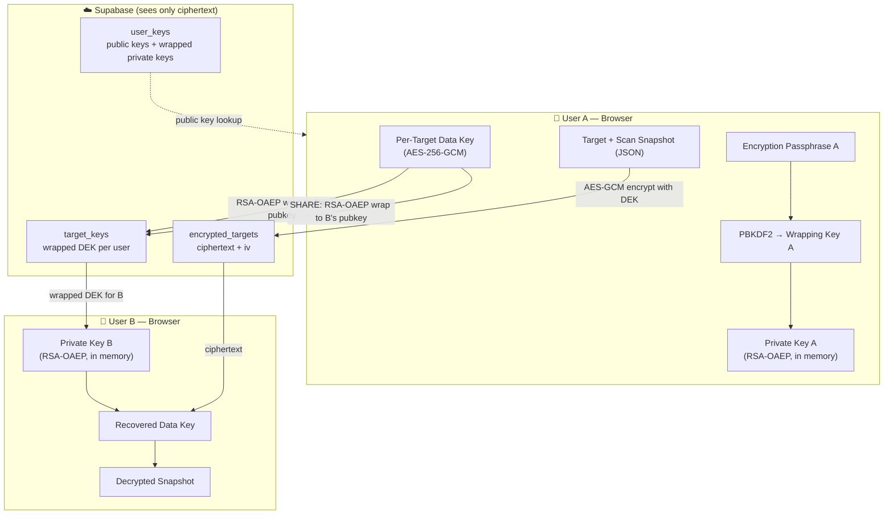
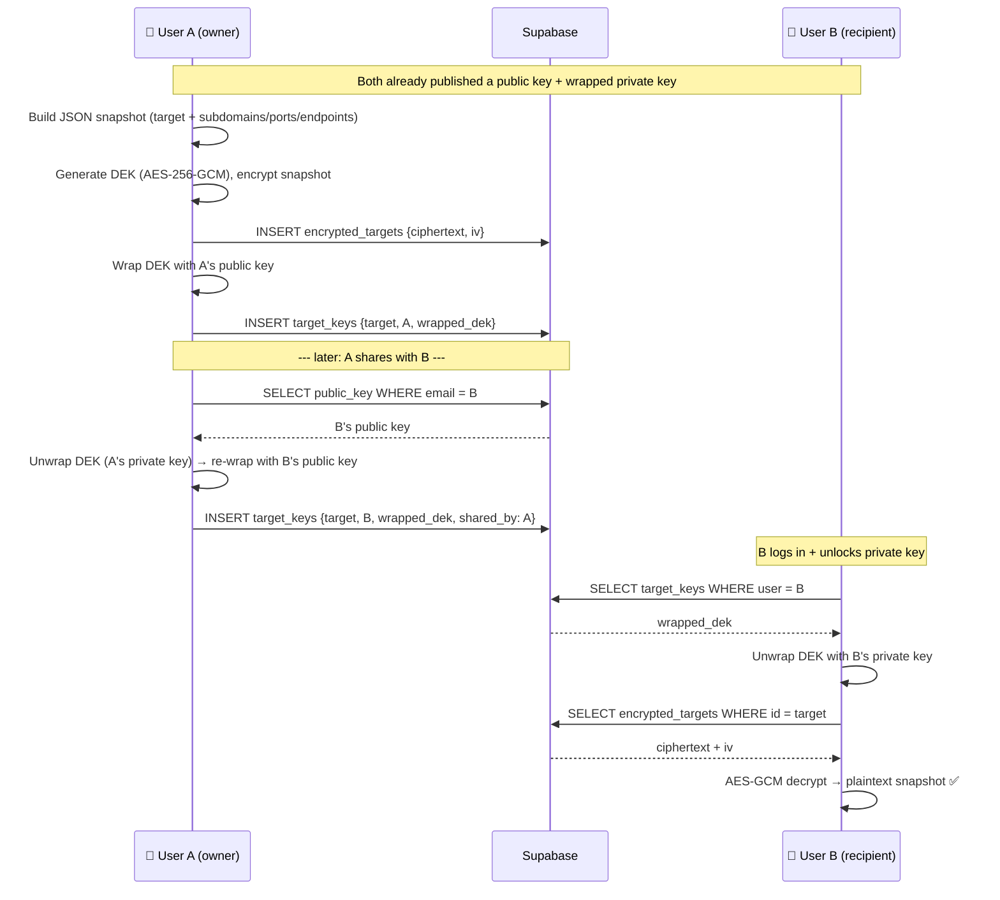

# RedKit POC — Login + End-to-End Encrypted Target Sharing

> Scope: a **small proof-of-concept** layered on the *existing* app. This does **not** replace
> [`ARCHITECTURE.md`](./ARCHITECTURE.md) — that remains the full production vision. This document
> describes only the minimal path to demonstrate: **log in → share a target (with its scan-results
> snapshot) with another user → the shared data is end-to-end encrypted** so the server can never read it.

---

## TL;DR — "What do we need rather than a backend host?"

**Nothing new to host.** The production stack in `ARCHITECTURE.md` (Auth Service `:3007`, Key Server
`:3008`, PostgreSQL, Redis, MinIO, Vault…) is aspirational and currently absent. The frontend is
already wired to **Supabase** (Backend-as-a-Service), which gives us auth + Postgres + row-level
security for free.

For the POC, Supabase plays two roles only:
1. **A dumb encrypted-blob store** — it holds ciphertext it cannot read.
2. **A public-key directory** — so users can look each other up to share.

All cryptography happens **in the browser**. We add three things:
1. A client-side **WebCrypto layer**.
2. **Three Supabase tables + RLS policies** (applied via the dashboard SQL editor — no hosting).
3. **Wiring** for the share flow (the "Share Target" button is currently a dead `<button>`).

---

## Current state (what already exists)

| Capability | Status | Location |
|------------|--------|----------|
| Login / signup | ✅ Works (Supabase) | `Front-End/src/api/supabase.ts`, `src/features/auth/` |
| Target + scan persistence | ✅ Works, but **plaintext** | Supabase tables `targets`, `subdomains`, `ports`, `endpoints` |
| "Share Target" button | ⚠️ Dead `<button>` (no handler) | `src/features/home/components/NewTargetModal.tsx:92` |
| Any cryptography | ❌ None | (crypto-js used only by the encoding toy-tools) |

**Confirmed POC decisions**
- **Separate encryption passphrase**, distinct from the Supabase login password → *true zero-knowledge*; Supabase never receives anything that can decrypt data. Lost passphrase = unrecoverable data (acceptable for a POC).
- **Encrypt "target + scan-results snapshot"** as a single JSON blob. Existing plaintext tables stay for normal non-shared use; the encrypted blob is the shareable artifact.
- A Supabase project **already exists**; env values just need to be placed.

---

## Crypto model — hybrid (envelope) encryption



1. **Per-user identity keypair** — RSA-OAEP 2048 / SHA-256, generated at encryption-setup time.
   - Public key (SPKI → base64) published to `user_keys` (readable by all authenticated users — it's the directory).
   - Private key (PKCS8) **wrapped** with AES-GCM using a key derived from the *encryption passphrase* via **PBKDF2** (SHA-256, ~310k iters, random salt). Stored as `encrypted_private_key` + `kdf_salt` + `pk_iv`. The server only ever sees the wrapped blob.
2. **Per-target Data Encryption Key (DEK)** — a random AES-256-GCM key. The target JSON snapshot is encrypted with the DEK → `ciphertext` + `iv` in `encrypted_targets`.
3. **Access = a wrapped copy of the DEK.** The DEK is RSA-OAEP-encrypted to each authorized user's public key and stored in `target_keys` (one row per user with access). The owner gets a row at creation.
4. **Sharing** = fetch recipient's public key by email → unwrap DEK with *own* private key → re-wrap DEK with *recipient's* public key → insert a `target_keys` row for the recipient. The server never sees the DEK or plaintext.

### Sharing sequence



### Key hierarchy

| Secret | Lives where | Server sees it? |
|--------|-------------|-----------------|
| Encryption passphrase | Browser only | ❌ never |
| PBKDF2 wrapping key | Browser memory | ❌ never |
| Private key (RSA) | Browser memory (unwrapped); wrapped blob in DB | ❌ (only the wrapped blob) |
| Public key | `user_keys` | ✅ (it's public) |
| DEK (per target) | Browser memory; wrapped copies in DB | ❌ (only wrapped) |
| Plaintext snapshot | Browser only | ❌ never |
| Ciphertext / iv | `encrypted_targets` | ✅ (unreadable) |

---

## Supabase schema (apply in dashboard SQL editor — no hosting)

```sql
-- Public-key directory + wrapped private key
create table user_keys (
  user_id uuid primary key references auth.users(id),
  email text not null,
  public_key text not null,            -- SPKI base64
  encrypted_private_key text not null, -- AES-GCM(PKCS8) base64
  kdf_salt text not null,
  pk_iv text not null,
  created_at timestamptz default now()
);

-- Encrypted target blobs (server cannot read)
create table encrypted_targets (
  id uuid primary key default gen_random_uuid(),
  owner_id uuid not null references auth.users(id),
  ciphertext text not null,  -- AES-GCM(JSON snapshot) base64
  iv text not null,
  created_at timestamptz default now()
);

-- Per-user wrapped DEK = access grant (owner row + shared rows)
create table target_keys (
  id uuid primary key default gen_random_uuid(),
  target_id uuid not null references encrypted_targets(id) on delete cascade,
  user_id uuid not null references auth.users(id),
  wrapped_dek text not null,  -- RSA-OAEP(DEK) base64
  shared_by uuid references auth.users(id),
  created_at timestamptz default now(),
  unique (target_id, user_id)
);
```

**RLS policies** (enable RLS on all three):
- `user_keys` — SELECT for any authenticated user; INSERT/UPDATE only where `user_id = auth.uid()`.
- `encrypted_targets` — SELECT where a `target_keys` row exists for `(id, auth.uid())`; INSERT where `owner_id = auth.uid()`.
- `target_keys` — SELECT where `user_id = auth.uid()`; INSERT allowed when the inserter already has access to `target_id` (an existing `target_keys` row for `(target_id, auth.uid())`), so an owner/holder can grant others without exposing plaintext.

---

## Frontend changes

**New files**
- `src/lib/crypto.ts` — WebCrypto utils: `generateIdentityKeyPair`, `deriveWrappingKey(passphrase, salt)`, `wrap/unwrapPrivateKey`, `generateDEK`, `encrypt/decryptPayload(dek, …)`, `wrapDEKForPublicKey`, `unwrapDEKWithPrivateKey`, base64 helpers.
- `src/api/sharing.ts` — Supabase calls: `publishKeys`, `getPublicKeyByEmail`, `getMyKeyRecord`, `insertEncryptedTarget`, `getMyEncryptedTargets` (join `target_keys`), `grantTargetKey` (share).
- `src/context/CryptoContext.tsx` — holds the unlocked private key (in-memory, non-extractable `CryptoKey`); `unlock(passphrase)`, `isUnlocked`, encrypt/decrypt helpers. Gate the app behind unlock after login.
- `src/features/auth/EncryptionSetup.tsx` — post-signup: set passphrase → generate keypair → `publishKeys`.
- `src/features/auth/UnlockVault.tsx` — post-login passphrase prompt to unlock the private key.
- `src/features/home/components/ShareTargetModal.tsx` — recipient-email input → run share flow.
- A "Shared with me" view listing `target_keys` rows decrypted client-side.

**Modified files**
- `src/api/supabase.ts` — route `signUp` into encryption setup; add an `insertEncryptedTarget` path alongside the existing `insertNewTarget`.
- `src/features/home/components/NewTargetModal.tsx:92` — replace the dead Share `<button>` with an action that opens `ShareTargetModal`.
- `Front-End/.env` — add `VITE_SUPABASE_URL` and `VITE_SUPABASE_PUBLISHABLE_DEFAULT_KEY`. If running the frontend via Docker, also add these to the `frontend.environment` block in `docker-compose.yaml` (currently absent).

**Reuse:** existing auth (`signIn`/`signUp`), `useGetUserLocally`/`useIsLogin` hooks, React Query (`queryKey: ["targets"]`), and the existing scan-result fetchers (`getSubdomains`/`getPorts`/`getEndpoints`) to build the JSON snapshot that gets encrypted.

---

## Verification (end-to-end, two users)

1. Place env values; apply schema + RLS in the Supabase dashboard.
2. `cd Front-End && npm install && npm run dev`.
3. Register **User A**, set encryption passphrase (keypair published).
4. As A: create a target, load/scan its data, encrypt + share to **User B's** email.
5. Log out; register/log in as **User B**, set passphrase, open "Shared with me" → decrypt and view A's snapshot.
6. **Confirm zero-knowledge:** in the Supabase table editor, verify `encrypted_targets.ciphertext` and `target_keys.wrapped_dek` are opaque base64 (no readable domain/findings).
7. **Negative test:** a third user **C** (not granted) cannot read the blob — RLS returns nothing.

---

## Out of scope (POC)

Migrating all existing plaintext tables to E2EE; passphrase recovery/rotation; ECDH (RSA-OAEP chosen for simplicity); revoking shares; the rest of the `ARCHITECTURE.md` stack (Vault / MinIO / Redis / monitoring).
